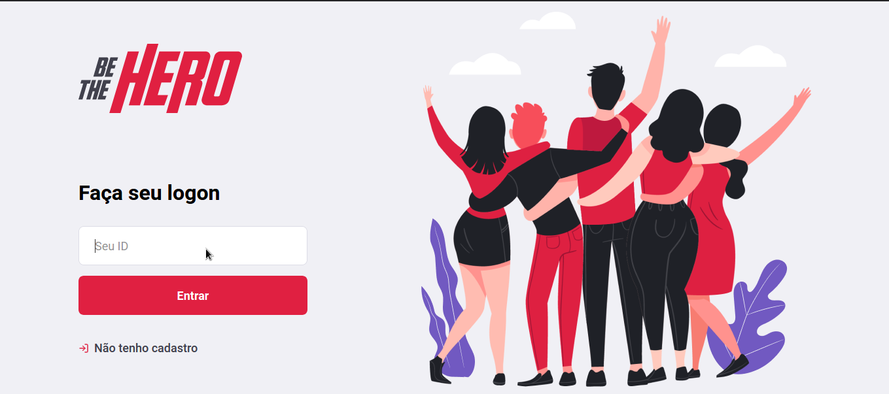
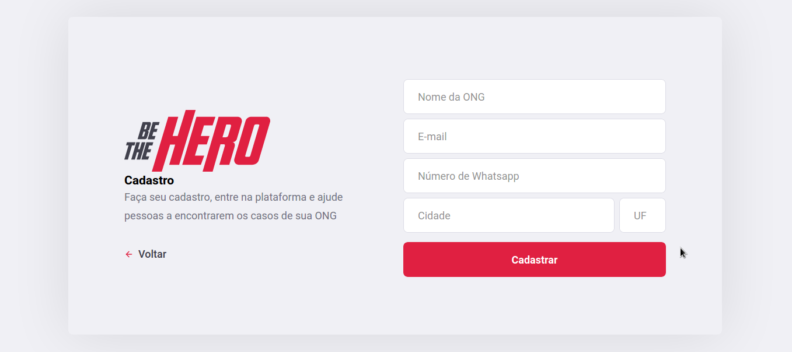
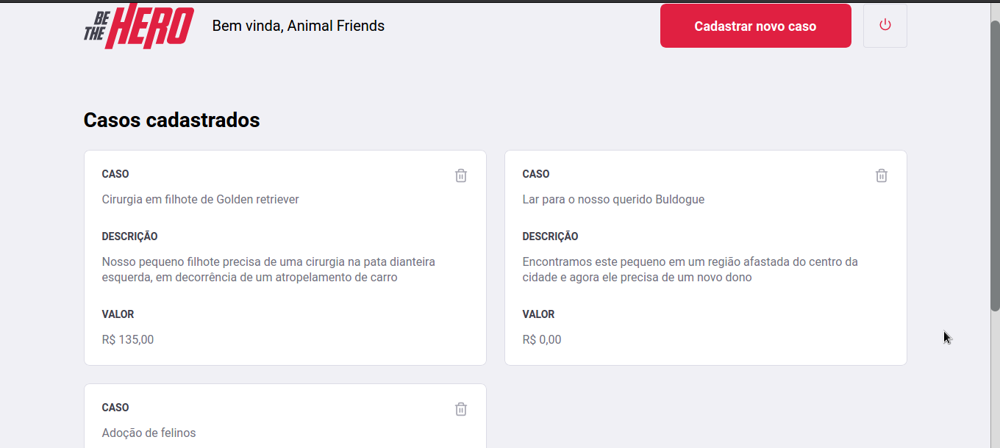
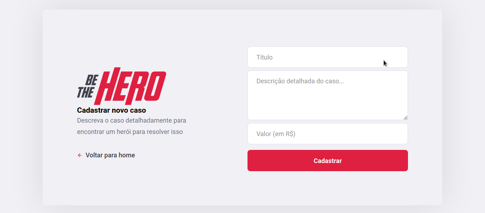
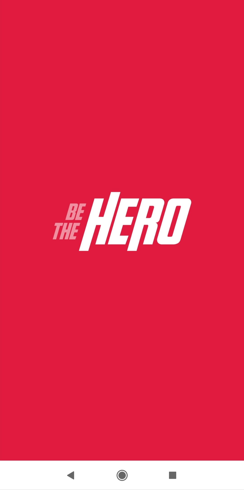
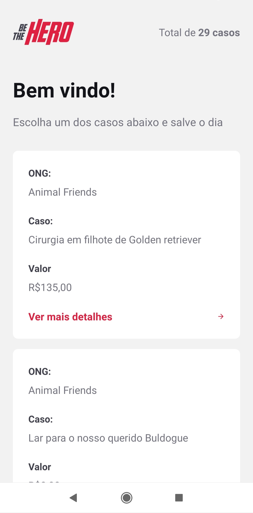
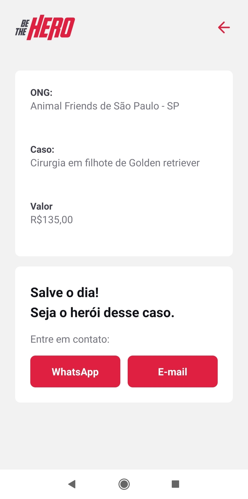
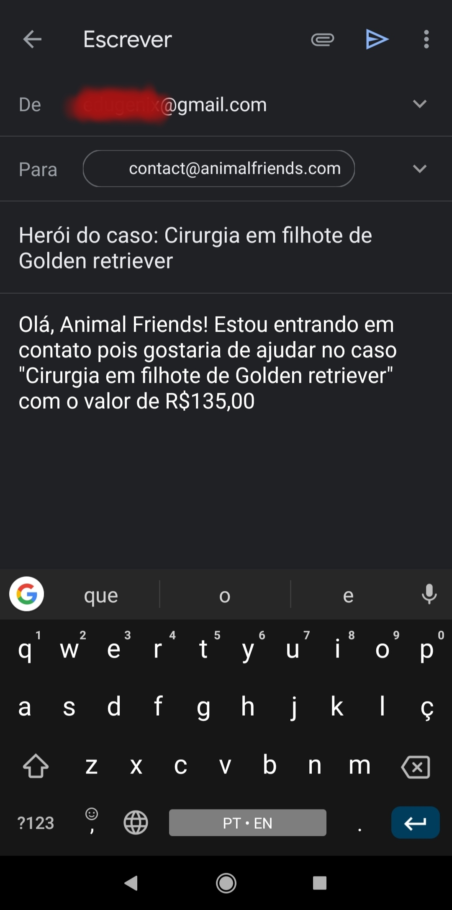

# Be The Hero

>Conecte pessoas que tem vontade de ajudar, mas que quase sempre não tem tempo, à ONGs diversas!
>Ajude ONGs a serem mais ativamente ajudadas pelas pessoas através da *Be The Hero*,
>onde pessoas podem ajudar de várias formas

## Navegação

### _Front-end_
>Aqui é onde se inicia a experiência! ONGs podem se cadastrar na plataforma e
>reportarem seus casos e deixarem seus contatos para possíveis interessados

#### Tela Inicial

#### Cadastro de uma ONG

#### Casos reportados pela ONG

#### Reportação de um caso pela ONG

### _Mobile_
>Aqui é onde pessoas podem se conectar com as ONGs!
>Todos os casos das ONGs são exibidos aqui e, junto com cada caso, as informações de contato de sua respectiva ONG, onde as pessoas interessadas podem obter mais informações

#### Tela de Splash

#### Casos reportados pelas ONGs

#### Detalhes de um caso

#### Envio de e-mail para a ONG responsável pelo caso
